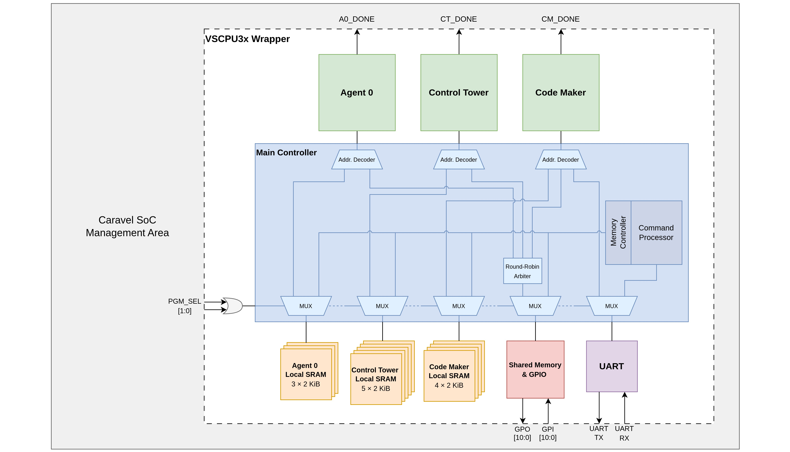

# Caravel VSCPU3x

[](LICENSE)

VSCPU3x is a three-core, 32-bit VerySimpleCPU system integrated into the
Caravel user project area for SKY130. It contains 24 KiB of local SRAM,
shared memory for communication between cores, 11 GPIO inputs and outputs,
and a UART for program loading, memory inspection, and application I/O.

This repository contains the RTL, Caravel simulation testbenches, OpenLane
configuration, and stored physical design outputs. The interface descriptions
below follow the RTL in [verilog/rtl](verilog/rtl). Stored gate-level netlists
and layout files are separate build outputs and should be regenerated when
the RTL changes.

## Architecture

The three cores are **CodeMaker (CM)**, **Control Tower (CT)**, and
**Agent 1**. Each core has a private program/data SRAM and a 14-bit word
address bus. Shared-memory requests are arbitrated using round-robin
selection. CodeMaker also accesses the UART through memory-mapped registers.



The diagram labels the agent core as **Agent 0**; it is named **Agent 1**
in the RTL and the interface descriptions below.

Local memory uses twelve `sky130_sram_2kbyte_1rw1r_32x512_8` macros, each
holding 512 32-bit words. The CPU implementation is in
[VerySimpleCPU.v](verilog/rtl/VerySimpleCPU.v); integration and memory routing
start in [user_project_wrapper.v](verilog/rtl/user_project_wrapper.v) and
[main_controller.v](verilog/rtl/main_controller.v).

## Memory map

All addresses below are **32-bit word addresses**. Each core has its own
local address space starting at zero.

| Core | Physical local address range | Words | Capacity | SRAM macros |
| --- | --- | ---: | ---: | ---: |
| CodeMaker | `0x0000–0x07FF` | 2,048 | 8 KiB | 4 |
| Control Tower | `0x0000–0x09FF` | 2,560 | 10 KiB | 5 |
| Agent 1 | `0x0000–0x05FF` | 1,536 | 6 KiB | 3 |
| **Total** | | **6,144** | **24 KiB** | **12** |

The controllers decode larger local windows than the installed SRAM. Keep
programs and data within the physical ranges above; additional decoded
addresses do not provide additional storage.

| Word address | Accessible by | Function |
| --- | --- | --- |
| `0x2000–0x203D` | All cores | 62 shared 32-bit words |
| `0x203E` | All cores | GPIO output register |
| `0x203F` | All cores | Synchronized GPIO input register |
| `0x2100–0x210F` | CodeMaker | UART register window |

The shared-memory decoder accepts `0x2000–0x20FF`, but only the low six
address bits reach [main_memory.v](verilog/rtl/main_memory.v). This repeats
the same 64 locations four times. Use the canonical `0x2000–0x203F` range.

For GPIO output writes, bits `[10:0]` carry the output value. When bit 31
is zero, all outputs are replaced. When bit 31 is one, bits `[26:16]`
select which output bits to update. Reading `0x203F` returns the 11 GPIO
inputs after three synchronization stages.

The active UART registers are implemented in
[uart_p.v](verilog/rtl/uart_p.v):

| Word address | Function |
| --- | --- |
| `0x2100` | RX FIFO empty flag in bit 0 |
| `0x2101` | Write bit 0 = 1 to request an RX FIFO read |
| `0x2102` | RX data in bits `[7:0]` |
| `0x2103` | TX data in bits `[7:0]` |
| `0x2104` | TX count; write 1 to enqueue one copy of the TX byte |
| `0x2105` | TX FIFO full flag in bit 0 |

## Caravel interface

The system clock is `wb_clk_i`. External reset and programming controls
come from the user I/O pins; `wb_rst_i` is not connected to the VSCPU reset.
Pin numbers below refer to Caravel user I/O indices.

| User I/O | Logical direction | Function |
| --- | --- | --- |
| `8` | Input | External reset request |
| `9` | Input | `program_sel[0]` |
| `10` | Input | `program_sel[1]` |
| `11` | Input | UART RX |
| `12` | Output | UART TX |
| `13` | Output | CodeMaker `done` |
| `14` | Output | Control Tower `done` |
| `15` | Output | Agent 1 `done` |
| `16–26` | Input | `gpio_in[10:0]` |
| `27–37` | Output | `gpio_out[10:0]` |

Set the UART divisor through `la_data_in[7:0]` before using the serial
interface. The UART uses 8 data bits, no parity, one stop bit, and 16×
oversampling:

```text
baud ≈ wb_clk_i frequency / (16 × divisor)
```

Use a nonzero 8-bit divisor. For example, a 40 MHz clock and divisor 22
produce approximately 113,636 baud.

[reset_circuit.v](verilog/rtl/reset_circuit.v) generates a one-clock internal
reset pulse a few clocks after the external reset falls. Apply a high-to-low
transition with the clock running. Holding the input high does not hold the
cores in reset. A core's `done` signal compares its current and previous
execution PC; applications can terminate with a self-branch. `pc_last` is
not initialized by reset, so `done` can initially be unknown in simulation.

**Wrapper integration limitations:** the pin table describes logical signal
connections. The current `io_oeb` assignment extends a constant-zero SRAM
address signal to the entire output-enable bus, so it does not implement
the input/output directions listed above. Wishbone response outputs,
`la_data_out`, `user_irq`, and unused `io_out` bits are undriven. Review
these connections when integrating the wrapper with Caravel pad control.

## UART programming and inspection

`program_sel = io_in[10:9]` selects who owns the memory and UART interfaces:

| `program_sel` | Mode |
| --- | --- |
| `00` | Run all cores; UART belongs to CodeMaker's application |
| `01` | UART access to CodeMaker local SRAM and shared memory |
| `10` | UART access to Control Tower local SRAM and shared memory |
| `11` | UART access to Agent 1 local SRAM and shared memory |

Before issuing commands, configure the baud divisor, select a programming
mode, and apply the external reset transition to initialize the UART and
command processor.

In any programming mode, normal memory responses to all three cores are
disabled. The command processor owns the SRAM ports until normal mode is
restored. Its protocol, implemented in [uart_cp.v](verilog/rtl/uart_cp.v),
uses ASCII commands and uppercase hexadecimal digits:

| Command | Effect |
| --- | --- |
| `Raaaa` | Set the address pointer to `aaaa` and return one word as eight hexadecimal characters, with no newline |
| `Wdddddddd` | Write one word at the current pointer, then increment the pointer by one word; no reply |

Only the low 14 bits of the four-digit address are used. To load consecutive
words, first issue a read to set the pointer and consume its eight-character
response, then send writes. For example:

```text
R0010       Set pointer to 0x0010 and read the existing word
W01234567   Write 0x01234567 at 0x0010
W89ABCDEF   Write 0x89ABCDEF at 0x0011
R0010       Read back 01234567
```

Send only the command strings, without the explanatory text. Select each
core in turn to load its image, initialize any shared data the application
needs, then return to `program_sel = 00` and apply the external reset
transition to start execution from address zero.

## Repository layout

| Path | Contents |
| --- | --- |
| [verilog/rtl](verilog/rtl) | CPU, controllers, UART, SRAM model, and Caravel wrapper |
| [verilog/dv](verilog/dv) | Caravel testbenches, management firmware, and sample memory images |
| [verilog/gl](verilog/gl) | Stored gate-level netlists |
| [openlane](openlane) | Hardening Makefile, configuration, and macro placement |
| [gds](gds), [lef](lef) | Layout and abstract views for the wrapper and macros |
| [def](def), [mag](mag), [maglef](maglef), [spi](spi) | Additional physical design and LVS outputs |
| [sdc](sdc), [sdf](sdf), [spef](spef), [signoff](signoff) | Timing constraints, parasitics, and stored reports |
| [docs/source](docs/source) | Inherited Caravel template documentation |

## License

The project is distributed under the [Apache License 2.0](LICENSE).
